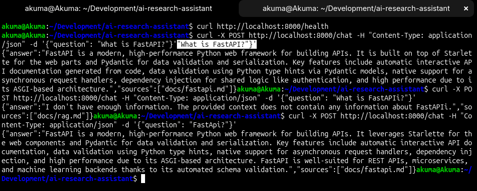
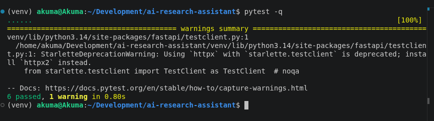

# AI Research Assistant API

A FastAPI backend which answers questions using a local knowledge base and an
LLM (RAG-style agent). The assistant retrieves relevant documents first, then
generates an answer grounded in that context and within the knowledge only.

## Pipeline
User Question
|
Retrieve relevant docs (TF-IDF similarity)
|
Build prompt (question + context)
|
LLM generates answer (Ollama)
|
Return { answer, sources }

## Setup

Requirements: Python 3.10+, [Ollama](https://ollama.com)

```bash
git clone <repo-url>
cd ai-research-assistant

python3 -m venv venv
source venv/bin/activate
pip install -r requirements.txt

cp .env.example .env

ollama pull qwen2.5:7b

uvicorn app.main:app --reload
```

API runs at http://localhost:8000 — interactive docs at http://localhost:8000/docs

## API Usage

### POST /chat

```bash
curl -X POST http://localhost:8000/chat \
  -H "Content-Type: application/json" \
  -d '{"question": "What is FastAPI?"}'
```

Response:

```json
{
  "answer": "FastAPI is a modern, high-performance Python web framework...",
  "sources": ["docs/fastapi.md"]
}
```

### GET /health

```bash
curl http://localhost:8000/health
# {"status": "healthy"}
```

## Demo



## Tests




## Architecture
app/
├── main.py              # FastAPI app, router registration
├── schemas.py           # Pydantic request/response models
├── routers/             # HTTP layer only (chat, health)
├── services/
│   ├── retriever.py     # Knowledge base loading + TF-IDF retrieval
│   ├── llm_client.py    # LLM provider abstraction (Ollama / OpenAI)
│   └── agent.py         # Pipeline: retrieve -> prompt -> generate
└── core/config.py       # Env-based settings
docs/                    # Knowledge base (markdown)
tests/                   # Unit tests

Design decisions:

- **Separation of concerns**: Routers only handles HTTP and all business logic 
is inside services folder with centralized configuration.
- - **Retrieval**: TF-IDF + cosine similarity for a small static knowledge
  base this is fast, deterministic, and needs no vector database. The
  Retriever exposes a single `retrieve()` method, so it can be swapped for
  embeddings later without touching other code.
- **LLM abstraction**: an abstract `LLMClient` interface with Ollama and
  OpenAI implementations, selected via the `LLM_PROVIDER` env variable.
  The agent is provider-agnostic.
- **Agent**: an explicit 4-step pipeline (retrieve, build prompt, generate,
  return sources) implemented directly, without an agent framework, so the
  control flow is transparent. The prompt restricts the model to the
  use only the retrieved context, which reduces hallucination.
- **Tests**: the LLM call is mocked, so tests run fast and offline.

## Assumptions

- The knowledge base was small with statis texts of md files which can be loaded once at statup and it can be handled easily for small data but for large data embeddings and vectordb can be used.
- Keyword-based (TF-IDF) retrieval is sufficient for this document count.
- One LLM provider active at a time but intregrated openai sdk for easy swift.